###### *Università Ca' Foscari - Venezia (2024/2025)*

# **Laboratorio ed Amministrazione di sistema**

**Autori**: Diego Marigo, Nicola Miotto

**Versione:** 1.0

**Versione Sistema Operativo:** Linux

*Il programma è progettato per assistere gli amministratori di sistema nella gestione di sistemi Linux. Fornisce strumenti e script utili per semplificare attività comuni di amministrazione, come la gestione dei file di log, l'esecuzione di script automatizzati e il monitoraggio del sistema. L'obiettivo è migliorare l'efficienza e ridurre gli errori nelle operazioni quotidiane.*

## **Struttura del Progetto**
```
sysAdmin-project/
├── eseguibile.bash         # Script eseguibile del programma
├── scripts/                # Script e risorse ausiliarie
│   ├── main.bash           # Entrypoint del programma
│   ├── codice_base.bash    # Funzioni di base condivise
│   ├── registrazioni.bash  # Gestione di registrazioni e log
│   ├── stilizzazione.bash  # Funzioni per la stilizzazione dell'output
│   ├── schermate/          # Schermate e menu del programma
│   └── log.txt             # File di log delle operazioni
├── README.md               # Documentazione del progetto
└── LICENSE                 # Licenza del progetto
```

## **Descrizione dei moduli**
### **Modulo `main.bash`**
Questo è il modulo principale che funge da entrypoint del programma. Gestisce l'input dell'utente, interpreta gli argomenti passati e chiama le funzioni appropriate dai moduli `codice_base.bash`, `stilizzazione.bash` e `registrazioni.bash`. Le funzioni principali includono:
- `main`: Funzione principale che gestisce l'esecuzione del programma, analizza gli argomenti e chiama le funzioni necessarie.

### **Modulo `codice_base.bash`**
Questo modulo contiene le funzioni di base condivise tra gli altri script. Fornisce utilità generali come la gestione degli errori, la stampa di messaggi e altre funzioni comuni che possono essere utilizzate in tutto il progetto.

### **Modulo `stilizzazione.bash`**
Questo modulo fornisce funzioni per la stilizzazione dell'output del programma. Include codici per colori e formattazione del testo, permettendo di rendere l'output più leggibile e visivamente accattivante. Le funzioni principali includono:
- `_stilizza`: Funzione generale per applicare stili specifici all'output.
- `con_grassetto`: Applica lo stile grassetto al testo.
- `con_sottolineatura`: Applica lo stile di sottolineatura al testo.
- `con_sbarramento`: Applica lo stile di sbarramento al testo.
- `come_info`: Applica lo stile informativo al testo.
- `come_successo`: Applica lo stile di successo al testo.
- `come_errore`: Applica lo stile di errore al testo.
- `come_avviso`: Applica lo stile di avviso al testo.
- `print`: Funzione per stampare l'output stilizzato, accettando un numero variabile di argomenti e applicando gli stili appropriati.
- `println`: Funzione per stampare l'output stilizzato con un ritorno a capo, accettando un numero variabile di argomenti e applicando gli stili appropriati.
- `printlines`: Funzione per stampare più linee di output stilizzato, accettando un numero variabile di argomenti e applicando gli stili appropriati.

> ⚠️ *Le funzioni di stilizzazione sono progettate per essere utilizzate in contesti di terminale che supportano i codici ANSI. In ambienti che non supportano i codici ANSI, l'output potrebbe non essere visualizzato correttamente.*

### **Modulo `registrazioni.bash`**
Questo modulo gestisce le registrazioni e i log del programma. Fornisce funzioni per registrare informazioni, errori e avvisi in un file di log. Le funzioni principali includono:
- `registra_info`: Registra un messaggio informativo nel log.
- `registra_successo`: Registra un messaggio di successo nel log.
- `registra_errore`: Registra un messaggio di errore nel log.
- `registra_avviso`: Registra un messaggio di avviso nel log.
- `apri_registro`: Apre il file di log per la lettura, permettendo di visualizzare le registrazioni effettuate. 
> ❗️ *Il file di log predefinito è `./log.txt`, ma può essere modificato passando un argomento al programma.*

### **Modulo `schermate/`**
Questo modulo contiene le schermate e i menu del programma. Fornisce funzioni per visualizzare le schermate principali, i menu di navigazione e altre interfacce utente. 

> 💡 *Tutte le schermate richiedono l'input dell'utente per la selezione dell'operazione desiderata. Il range di valori accettati è specificato in ogni schermata. Per tornare al menu principale, è possibile premere il tasto `q` in qualsiasi schermata.*

> ⚠️ *Tutte le operazioni vengono svolte con privilegi di amministratore.*

Le schermate principali includono:
- `schermate.bash`: Raccoglie tutte le schermate e i menu del programma, permettendo di visualizzare le opzioni disponibili e guidare l'utente attraverso le funzionalità del sistema.
- `principale.bash`: Schermata principale del programma, che fornisce un menu di navigazione per accedere alle diverse funzionalità.
- `manuale.bash`: Schermata per il manuale del programma, che fornisce informazioni dettagliate su come utilizzare le diverse funzionalità del sistema.
- `gestione_disco.bash`: Schermata per la gestione delle partizioni del disco, che consente di creare, eliminare e modificare le partizioni. 
    1) *Aggiungi disco*: consente di aggiungere un nuovo disco al sistema (`fdisk -l $nomeDisco`).
    2) *Rimuovi disco*: consente di rimuovere un disco dal sistema (`fdisk -l $nomeDisco`).
    3) *Visualizza partizioni*: consente di visualizzare le partizioni esistenti (`fdisk -l`).
    4) *Formatta partizione*: consente di formattare una partizione specifica (`mkfs.ext4 $nomeDisco`).
    5) *Controlla filesystem*: consente di controllare lo stato di un filesystem (`fsck -f $nomeDisco`).
    6) *Crea cartella*: consente di creare una nuova cartella in una partizione specifica (`mkdir $nomeCartella`).
    7) *Rimuovi cartella*: consente di rimuovere una cartella specifica (`rm -r $nomeCartella`).
    8) *Visualizza contenuto cartella*: consente di visualizzare il contenuto di una cartella (`ls $nomeCartella`).
    9) *Crea file*: consente di creare un nuovo file in una cartella specifica (`touch $nomeFile`).
    10) *Rimuovi file*: consente di rimuovere un file specifico (`rm $nomeFile`).
    11) *Visualizza file*: consente di visualizzare il contenuto di un file specifico (`cat $nomeFile`).
    12) *Backup file*: consente di creare un backup di un file specifico (`rsync -av --delete --progress "$file" "$file.bak"`).
    13) *Ripristina file*: consente di ripristinare un file da un backup specifico (`rsync -av --delete --progress "$file.bak" "$file"`).
- `gestione_pacchetti.bash`: Schermata per la gestione dei pacchetti, che consente di installare, rimuovere e aggiornare i pacchetti software del sistema.
    1) *Installa pacchetto*: consente di installare un pacchetto specifico (`apt install $nomePacchetto`).
    2) *Rimuovi pacchetto*: consente di rimuovere un pacchetto specifico:
        - con dipendenze: `apt remove --purge "$pacchetto" && apt autoremove -y`
        - senza dipendenze: `apt remove "$pacchetto"`
    3) *Aggiorna pacchetti*: consente di aggiornare un pacchetto (`apt update && apt upgrade -y`).
    4) *Elenco pacchetti installati*: consente di visualizzare l'elenco dei pacchetti installati (`apt list --installed`)
- `gestione_rete.bash`: Schermata per la gestione della rete, che consente di configurare le interfacce di rete, visualizzare le connessioni attive e monitorare il traffico di rete.
    1) *Visualizza configurazione rete*: consente di visualizzare la configurazione delle interfacce di rete (`ip addr show`).
    2) *Modifica configurazione rete*: consente di modificare la configurazione delle interfacce di rete (`ip addr add "$ip" dev "$interfaccia"`).
    3) *Visualizza stato rete*: consente di visualizzare lo stato delle interfacce di rete (`systemctl status NetworkManager`).
    4) *Modifica stato rete*: consente di modificare lo stato delle interfacce di rete (`ip link set "$interfaccia" "$stato"`).
    5) *Visualizza statistiche rete*: consente di visualizzare le statistiche delle interfacce di rete (`ifconfig "$interfaccia" "$valore"`).
    6) *Gestione firewall*: consente di gestire le regole del firewall:
        - Avviare/Arrestare/Visualizzare lo stato del firewall: `ufw "comando"`
        - Consentire/Negare un indirizzo IP o un dominio: `ufw "$stato" "$indirizzo"`
    7) *Test di rete*: consente di eseguire un test di rete (`ping -c 4 "$indirizzo"`).
- `gestione_servizi.bash`: Schermata per la gestione dei servizi di sistema, che consente di avviare, fermare e monitorare i servizi in esecuzione.
    1) *Avvia servizio*: consente di avviare un servizio specifico (`systemctl start "$servizio"`).
    2) *Arresta servizio*: consente di arrestare un servizio specifico (`systemctl stop "$servizio"`).
    3) *Riavvia servizio*: consente di riavviare un servizio specifico (`systemctl restart "$servizio"`).
    4) *Visualizza elenco servizi*: consente di visualizzare l'elenco dei servizi attivi (`systemctl list-units --type=service --state=running --no-pager`).
    5) *Abilita/Disabilita servizio all'avvio*: consente di abilitare o disabilitare un servizio all'avvio del sistema (`systemctl $stato" "$servizio"`).
- `gestione_utenti.bash`: Schermata per la gestione degli utenti, che consente di aggiungere, rimuovere e modificare gli utenti del sistema.
    1) *Aggiungi utente*: consente di aggiungere un nuovo utente al sistema e impostare la sua password (`useradd "$nome_utente" && passwd "$nome_utente"`).
    2) *Modifica nome utente*: consente di modificare le informazioni di un utente esistente (`usermod -l "$nome_utente" "$nuovo_nome_utente"`).
    3) *Modifica password utente*: consente di modificare la password di un utente esistente (`chpasswd <<< "$nome_utente:$password_utente"`).
    4) *Modifica gruppo utente*: consente di modificare il gruppo di appartenenza di un utente (`usermod -g "$nuovo_gruppo" "$nome_utente"`).
    5) *Modifica permessi utente*: consente di modificare i permessi di un utente (`usermod -aG "$gruppo_permessi" "$nome_utente"`).
    6) *Modifica scadenza password utente*: consente di modificare la scadenza della password di un utente (`chage -M "$data_scadenza" "$nome_utente"`).
    7) *Modifica scadenza account utente*: consente di modificare la scadenza dell'account di un utente (`chage -E "$data_scadenza" "$nome_utente"`).
    8) *Modifica stato account utente*: consente di modificare lo stato dell'account di un utente:
        - Abilitare account: `usermod -U "$nome_utente"`
        - Disabilitare account: `usermod -L "$nome_utente"`
    9) *Elimina utente*: consente di rimuovere un utente dal sistema (`userdel "$nome_utente"`).
    10) *Visualizza elenco utenti*: consente di visualizzare l'elenco degli utenti del sistema (`cut -d: -f1 /etc/passwd`).
- `monitoraggio.bash`: Schermata per il monitoraggio delle risorse di sistema, che consente di visualizzare l'utilizzo della CPU, della memoria e del disco.
    1) *Visualizza utilizzo CPU*: consente di visualizzare l'utilizzo della CPU in tempo reale (`top --batch-mode --iterations=1 | head -n 20`).
    2) *Visualizza utilizzo memoria*: consente di visualizzare l'utilizzo della memoria in tempo reale (`free -h`).
    3) *Visualizza utilizzo disco*: consente di visualizzare l'utilizzo del disco in tempo reale (`df -h`).
    4) *Visualizza stato rete*: consente di visualizzare lo stato delle interfacce di rete (`netstat`).
    5) *Visualizza servizi attivi*: consente di visualizzare i servizi attivi e il loro stato (`systemctl list-units --type=service --state=running --no-pager`).
    6) *Visualizza utenti connessi*: consente di visualizzare gli utenti connessi al sistema (`who`).
- `operazioni_di_sistema.bash`: Schermata per le operazioni di sistema, che consente di eseguire operazioni come il riavvio, lo spegnimento e la gestione dei file di log.
    1) *Visualizza log sistema*: consente di visualizzare i log di sistema (`tail -f /var/log/syslog`).
    2) *Visualizza log accesso*: consente di visualizzare i log degli accessi al sistema (`tail -f /var/log/auth.log`).
    3) *Visualizza log errori*: consente di visualizzare i log degli errori del sistema (`tail -f /var/log/kern.log`).
    4) *Visualizza log sicurezza*: consente di visualizzare i log di sicurezza del sistema (`tail -f /var/log/secure`).
    5) *Visualizza log rete*: consente di visualizzare i log della rete (`tail -n 50 /var/log/messages`).
    6) *Visualizza log pacchetti*: consente di visualizzare i log dei pacchetti (`tail -n 50 /var/log/apt/history.log`).
    7) *Visualizza log applicazioni*: consente di visualizzare i log delle applicazioni (`tail -n 50 /var/log/daemon.log`).
    8) *Spegni/riavvia sistema*: consente di spegnere o riavviare il sistema:
        - Spegnimento: `shutdown`
        - Riavvio: `shutdown`

## **Esecuzione script**

### **Requisiti di sistema**
Pacchetti utilizzati all'interno del programma:
- `apt`: Per la gestione dei pacchetti.
- `bash`: Per l'esecuzione degli script.
- `cut`: Per elaborare i file di testo.
- `chage`: Per modificare le informazioni sulle password degli utenti.
- `chmod`: Per modificare i permessi dei file.
- `chpasswd`: Per cambiare le password degli utenti.
- `df`: Per visualizzare lo spazio su disco disponibile.
- `fdisk`: Per la gestione delle partizioni del disco.
- `free`: Per visualizzare la memoria disponibile.
- `fsck`: Per controllare e riparare i file system.
- `ifconfig`: Per visualizzare e configurare le interfacce di rete.
- `iftop`: Per monitorare il traffico di rete in tempo reale.
- `ip`: Per visualizzare e configurare le interfacce di rete.
- `mkfs.ext4`: Per formattare le partizioni in ext4.
- `netstat`: Per visualizzare le connessioni di rete.
- `ping`: Per testare la connettività di rete.
- `reboot`: Per riavviare il sistema.
- `rsync`: Per sincronizzare file e directory.
- `systemctl`: Per gestire i servizi di sistema.
- `shutdown`: Per spegnere o riavviare il sistema.
- `tail`: Per visualizzare le ultime righe di un file.
- `top`: Per monitorare le risorse di sistema in tempo reale.
- `ufw`: Per gestire il firewall.
- `useradd`: Per aggiungere nuovi utenti al sistema.
- `userdel`: Per rimuovere utenti dal sistema.
- `usermod`: Per modificare le informazioni degli utenti.
- `who`: Per visualizzare gli utenti connessi al sistema.

#### **Installazione dei requisiti**
Assicurarsi di avere installato i seguenti pacchetti sul sistema:
```bash
sudo apt update
sudo apt upgrade
sudo apt install -y apt bash cut chage chmod chpasswd df fdisk free fsck ifconfig iftop ip mkfs.ext4 netstat ping reboot rsync systemctl shutdown tail top ufw useradd userdel usermod who
```
Questi pacchetti sono generalmente preinstallati su molte distribuzioni Linux, ma è sempre meglio verificarne la presenza.

### **Installazione ed esecuzione del programma**
1. Clonare il repository GitHub:
    ```bash
    git clone https://github.com/Diego-Marigo/sysAdmin-project.git
    ```

2. Spostarsi nella directory del progetto:
    ```bash
    cd sysAdmin-project
    ```

3. Rendere eseguibile lo script principale:
    ```bash
    chmod +x eseguibile.bash
    ```

4. Avviare lo script con permessi di superutente:
    ```bash
    sudo ./eseguibile.bash
    ```

### **Argomenti dello script**
Lo script principale `eseguibile.bash` accetta diversi argomenti per eseguire operazioni specifiche. Gli argomenti disponibili sono:
- `--help` | `-h`: Mostra l'elenco dei comandi disponibili e una breve descrizione.
- `--version` | `-v`: Mostra la versione corrente del programma.
- `--registro` | `-r`: Imposta il file di log da utilizzare per le registrazioni. Se non specificato, il file predefinito è `./log.txt`.
- `--debug` | `-d`: Abilita la modalità di debug, mostrando informazioni dettagliate sull'esecuzione del programma. Utile per identificare e risolvere eventuali problemi.
- `--no-color`: Disabilita l'uso dei colori nell'output del programma, utile per ambienti che non supportano la colorazione del testo o per una visualizzazione più semplice.

## **Codice progetto**
Il codice del progetto è scritto in Bash e utilizza le funzionalità di scripting per gestire le operazioni di amministrazione del sistema. Le funzioni sono modulari e possono essere facilmente estese o modificate per aggiungere nuove funzionalità. Il codice è organizzato in moduli per facilitare la manutenzione e la comprensione.

## **Screenshot del programma**
Sono inclusi alcuni screenshot del programma in esecuzione per fornire una panoramica delle schermate e delle funzionalità disponibili.
### **Screenshot schermata avvio**
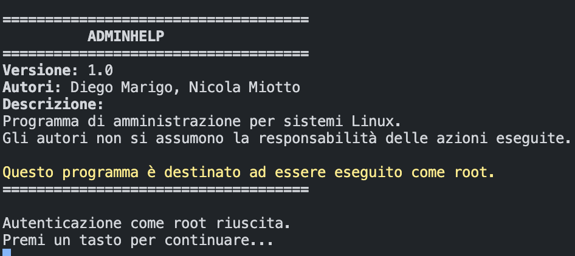
### **Screenshot schermate principali**
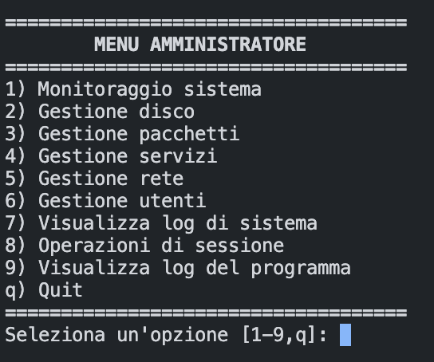
### **Screenshot schermata gestione disco**
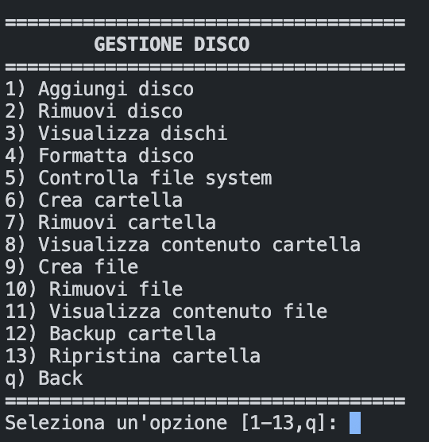
### **Screenshot schermata gestione pacchetti**
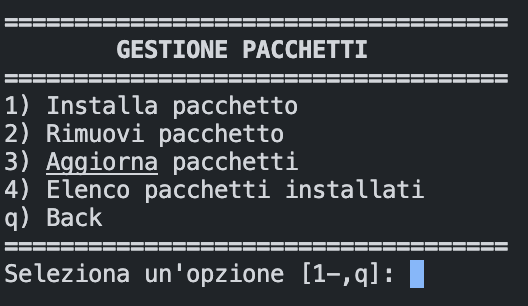
### **Screenshot schermate gestione rete**
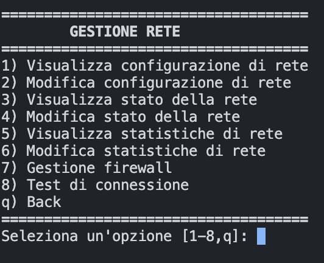
### **Screenshot schermate gestione servizi**
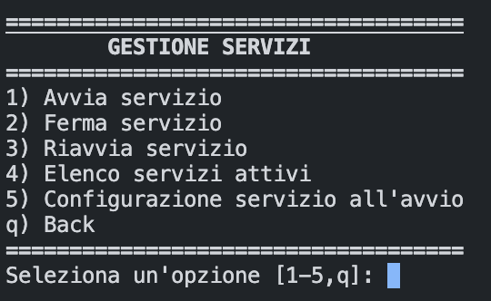
### **Screenshot schermate gestione utenti**
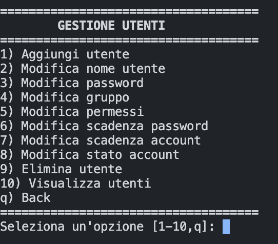
### **Screenshot schermata operazioni di sistema**
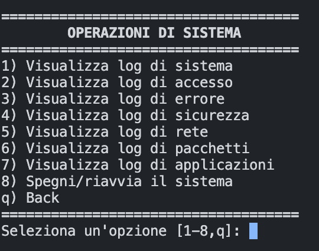
### **Screenshot schermata monitoraggio**
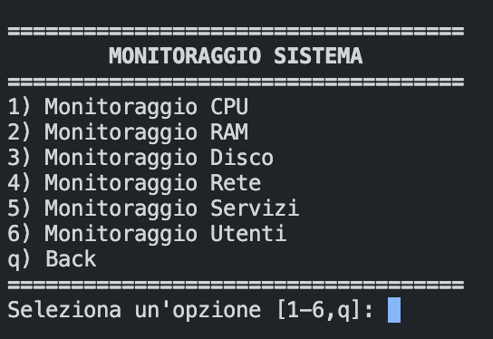
### **Screenshot schermata visualizzazione log**
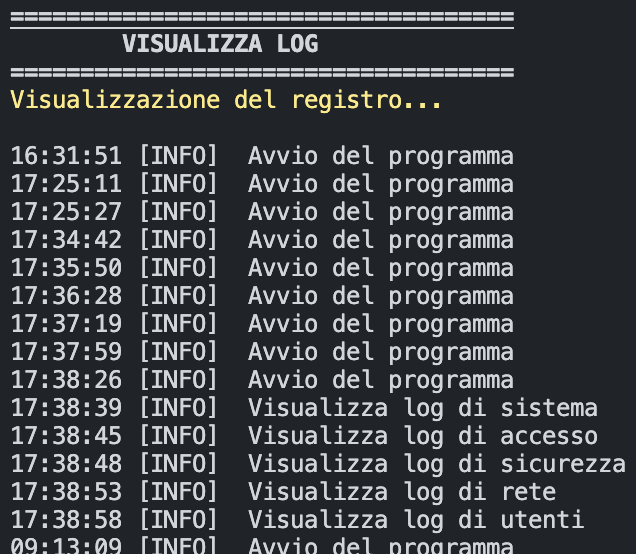
### **Screenshot schermata uscita**
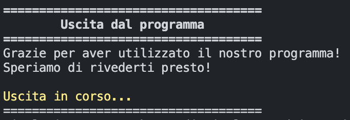
### **Screenshot schermata manuale**
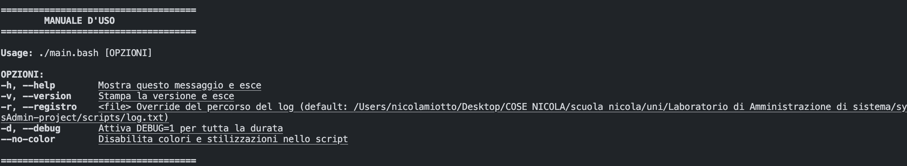